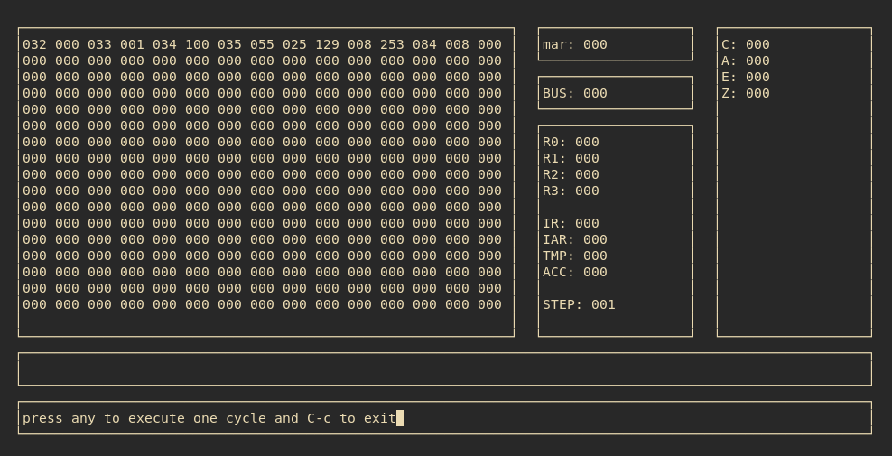

# Minimalistic And Naive 8 Bits CPU Simulator And Assembler

Made for fun, c learning, computer learning.    



# Usage 

```
    $ make 
    $ ./asm.bin fibonnaci.asm           # compile fibonnaci.asm
    $ ./computer.bin fibonnaci.bin      # run fibonnaci program in 8 bits computer

```

# Todo

- [x] write your own assembly compiler   
- [x] change asm program to include symbol
- [x] refactor for more clarity of code 
- [x] asm output filename = entry output filename 
- [x] remove global var  
- [x] remove empty lines check everywhere and put it during loading of file
- [x] let a program be passed in parameter   
- [x] add quick expanation for next cycle or exit 
- [x] take carry flag as input for add, shr, shl    
- [x] shr, shl are not correct they use two operands     
- [x] check which operations affect which flags on dia c,a,e,z    
- [x] using enum for flag instead of boolean variables    
- [x] do I really need byte cf = computer.alu.flags[c] ? 1 : 0;    
- [x] be able to execute cycle per cycle with info     
- [x] display graphical rendering of memory, regs... (use ncurse lib)    
- [x] exception for not moving acc to register in case of CMP not very clean       
- [x] verify not_and_or_xor    
- [x] create make file 
- [x] write fibonnaci   
- [ ] write a correct readme (supported instructions etc...)    
- [ ] seriously loading file sucks, better way of doing this 